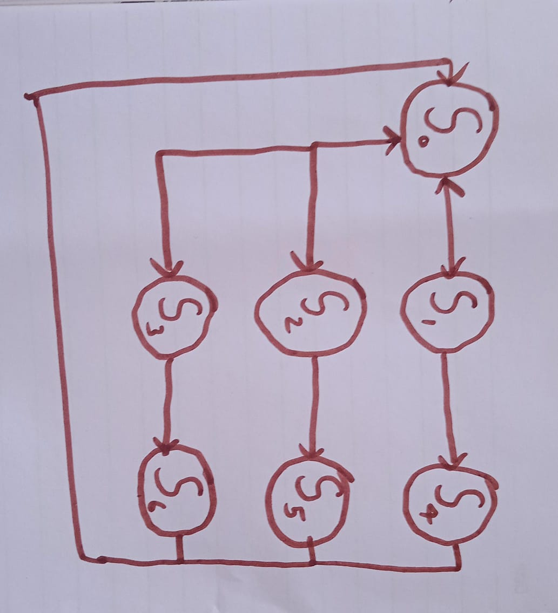

# Simple-Vending-Machine-FSM-in-Verilog
Simple Vending Machine FSM made using Verilog.

This is my first attempt of doing something on my own in Verilog. 

Functionality:

Inputs to the FSM:-
User inputs:-
1) 3 Product select buttons
2) 1 Cancel button

Sensor inputs:-
1) Payment status
2) Dispensing status
3) Product availability status

Outputs by the FSM:-
The only output by the FSM is the Dispense control signals of each product.

State Diagram:-

